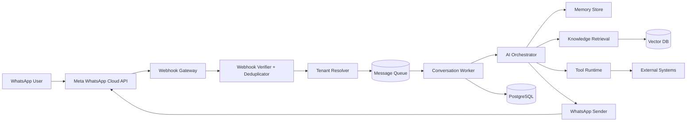
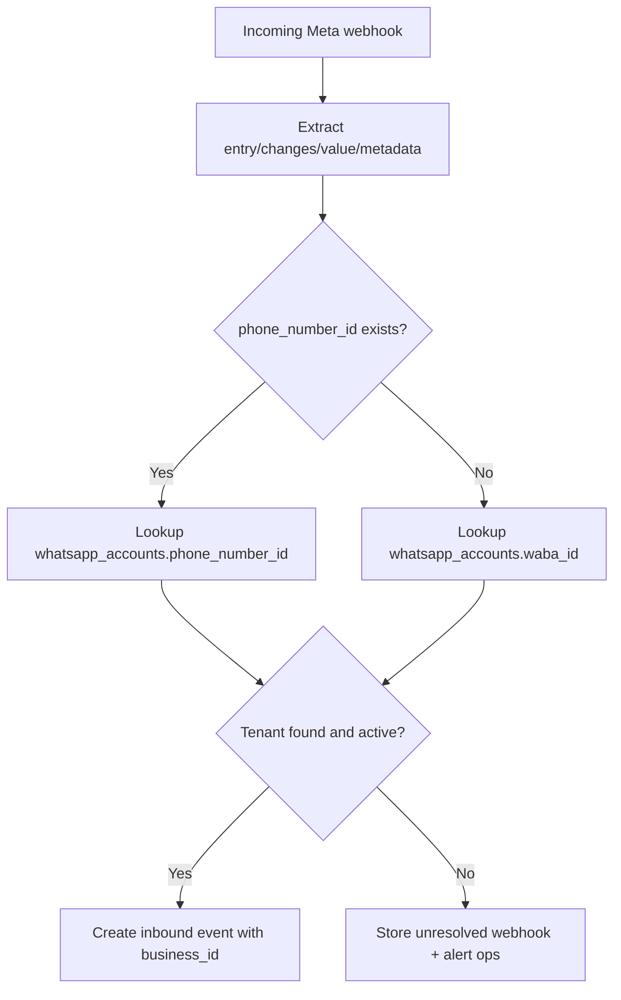
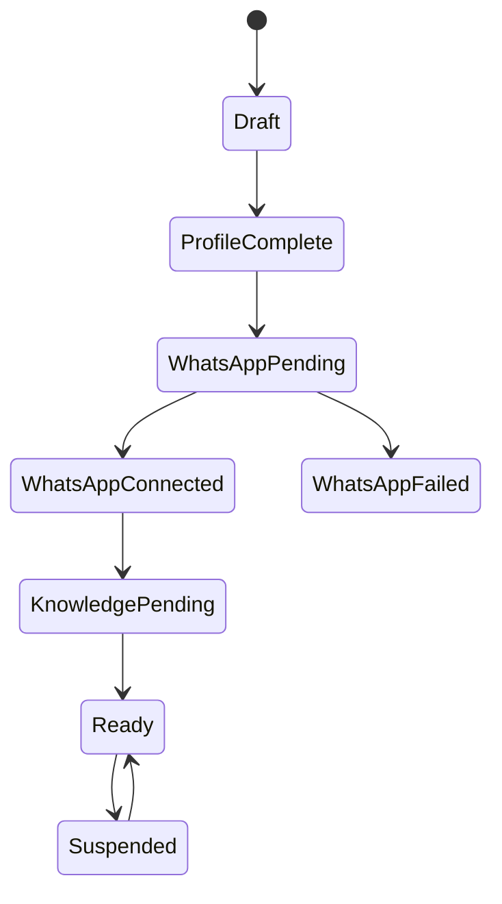
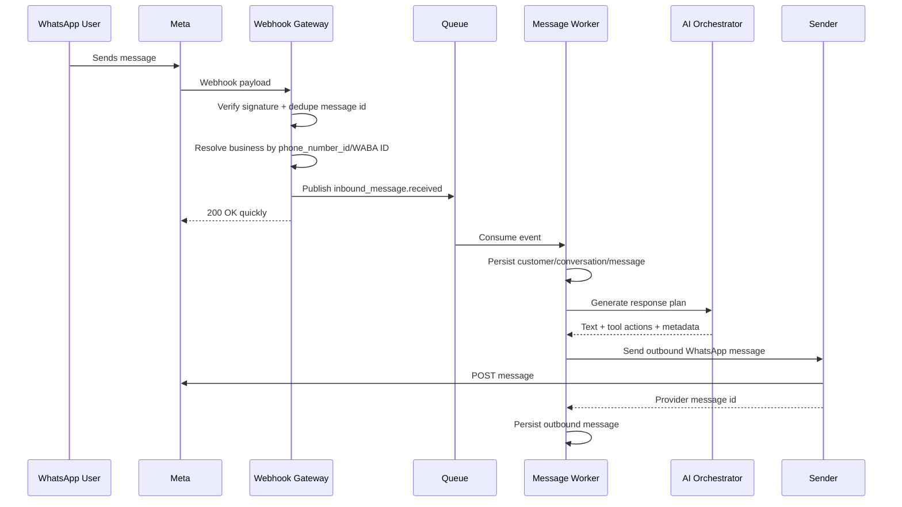
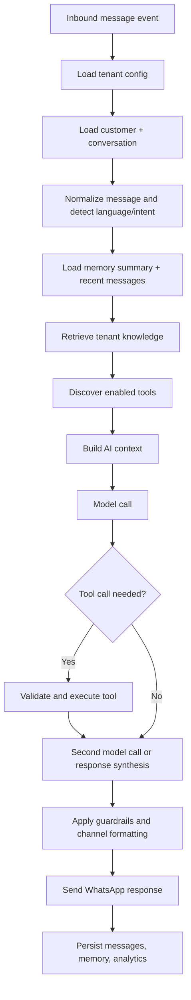
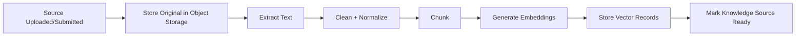
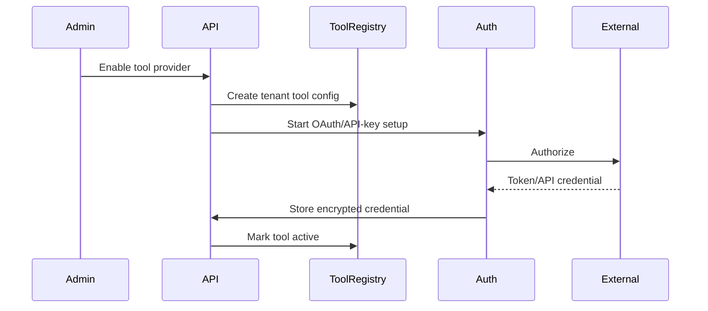

# Multi-Tenant AI WhatsApp SaaS Platform Architecture

## 1. Architecture Decisions

### Reference Stack

- Frontend: Next.js or React SPA, TypeScript, tenant admin portal, operator inbox, analytics.
- Backend API: NestJS, FastAPI, Django REST, or similar modular service framework.
- Primary DB: PostgreSQL.
- Vector DB: pgvector for early scale; Pinecone, Weaviate, Qdrant, or Milvus when vector volume/latency requires separation.
- Cache/rate limits: Redis Cluster.
- Queue/event bus: Kafka, Redpanda, RabbitMQ, or SQS/SNS. Use Kafka/Redpanda for very high message volume.
- Object storage: S3-compatible bucket for PDFs, scraped HTML, media, generated files.
- AI gateway: central abstraction over OpenAI/Anthropic/local models.
- Secrets: cloud KMS + envelope encryption, or Vault.
- Observability: OpenTelemetry, centralized logs, metrics, traces, dead-letter queues.

### Core Principle

Every runtime operation is tenant-scoped by `business_id`. WhatsApp inbound routing is resolved from Meta webhook metadata:

- `phone_number_id` preferred.
- `waba_id` fallback.
- Optional fallback to `display_phone_number`, but only for diagnostics because phone formatting can vary.

## 2. High-Level System



### Services

- API Service: tenant admin APIs, dashboard APIs, settings, users, tools, knowledge.
- Webhook Gateway: receives all Meta webhooks, verifies signatures, resolves tenant, emits events.
- Message Worker: processes inbound messages asynchronously.
- AI Orchestrator: builds prompt context, retrieves knowledge, calls tools, returns response plan.
- WhatsApp Sender: sends outbound messages, tracks provider request/response.
- Ingestion Worker: parses PDFs/websites/FAQs and creates embeddings.
- Tool Runtime: executes tenant-authorized external actions.
- Analytics Worker: aggregates conversations, latency, resolution rate, handoff rate, spend.

## 3. Multi-Tenant Model

### Tenant Isolation Strategy

- All business-owned tables include `business_id`.
- Enforce `business_id` in application middleware and DB row-level security where possible.
- Never trust client-supplied `business_id` alone; derive allowed businesses from authenticated user membership.
- Background jobs must include `business_id`, `correlation_id`, and `idempotency_key`.
- Vector records include `business_id`, `knowledge_document_id`, `chunk_id`, and metadata filter.
- Cache keys must be prefixed: `business:{business_id}:...`.

### Tenant Resolution



## 4. Business Onboarding

### Onboarding Flow

1. Create business profile: legal name, display name, timezone, locale, industry, plan.
2. Create first admin user and membership.
3. Configure AI defaults: tone, language, escalation rules, allowed actions.
4. Connect WhatsApp:
   - Manual credentials: App ID, App Secret, access token, Phone Number ID, WABA ID.
   - Embedded signup/OAuth later if supported by product scope.
5. Validate credentials by calling Meta account/phone endpoints.
6. Register or verify webhook subscription.
7. Send test message or perform webhook challenge check.
8. Enable business only after WhatsApp account status is `connected`.
9. Ingest initial FAQs, services, SOPs, and business profile.

### State Machine



## 5. WhatsApp Integration Architecture

### Credential Storage

- Store App ID and Phone Number ID as non-secret fields.
- Store App Secret and access tokens encrypted with envelope encryption.
- `encrypted_value`, `key_id`, `algorithm`, `created_at`, `rotated_at`, `expires_at`.
- Decrypt only inside backend services that need outbound Meta calls.
- Never expose access tokens to frontend after save.

### Webhook Registration

- Use one platform webhook callback URL for all tenants:
  - `POST /webhooks/meta/whatsapp`
  - `GET /webhooks/meta/whatsapp` for challenge verification.
- Webhook verify token should be platform-level or per-Meta app. If tenants use separate Meta apps, store per-app verify token and resolve by query/context where possible.
- Subscribe to messages and message status events.

### Incoming Message Processing



### Outgoing Message Delivery

- Sender loads tenant WhatsApp credentials by `business_id`.
- Validate conversation window/template requirements before send.
- Persist outbound message as `queued`.
- Call Meta messages API.
- Update message with provider message id and status `sent_to_provider`.
- Later status webhooks update `sent`, `delivered`, `read`, or `failed`.

### Token Management

- Support long-lived tenant tokens at launch.
- Track `expires_at`, `last_validated_at`, `scope`, `token_type`.
- Daily token health job validates credentials and marks account `reauth_required` if invalid.
- Token rotation endpoint accepts new token and immediately runs validation.

### Status Tracking

- Store raw provider status payload.
- Maintain latest status on `messages`.
- Append immutable events to `message_status_events`.
- Status updates are idempotent using provider message id + status + timestamp.

## 6. AI Agent Architecture

### Components

- AI Orchestrator: top-level planner for response generation.
- Conversation Engine: state, turn-taking, handoff, language, channel constraints.
- Memory Layer: conversation history, customer profile, preferences, summaries.
- Knowledge Retrieval: RAG query rewriting, vector search, reranking.
- Tool Calling Layer: exposes tenant-enabled tools and validates execution.
- Context Manager: token budget, prompt assembly, compression.
- Safety/Policy Layer: tenant business rules, blocked topics, escalation.

### Per-Message Workflow



### Prompt Context Contract

For each AI call include:

- Tenant identity: business name, industry, timezone, language.
- Assistant role: virtual employee scope and tone.
- Business rules: escalation, refund, booking, legal/medical disclaimers.
- Customer state: name, phone, preferences, tags, previous issues.
- Conversation memory: summary + last N turns.
- Retrieved knowledge: cited chunks with document metadata.
- Available tools: schemas, auth state, constraints.
- Output contract: JSON response plan with `reply_text`, `actions`, `confidence`, `handoff_required`.

## 7. RAG / Knowledge Base Architecture

### Supported Sources

- Manual FAQs.
- Service catalog.
- SOPs and policy documents.
- PDFs.
- Website URLs and sitemap crawl.
- CSV/product catalogs.
- Admin-authored business profile fields.

### Ingestion Pipeline



### Tenant Isolation

- `knowledge_sources.business_id` owns source.
- `knowledge_chunks.business_id` duplicated for fast filters.
- Vector metadata always contains `business_id`.
- Retrieval query must filter by `business_id` and allowed source status.
- No cross-tenant global semantic search for customer-facing answers.

### Retrieval Process

1. Rewrite user query using conversation context.
2. Apply tenant filters: `business_id`, language, source type, status.
3. Top-K vector search.
4. Optional keyword hybrid search.
5. Rerank by relevance, freshness, authority.
6. Return compact chunks with citations and confidence.
7. If confidence below threshold, ask clarifying question or hand off.

## 8. Generic Tool Calling Architecture

### Tool Model

A tool is a tenant-enabled capability with:

- Provider: Google Calendar, HubSpot, Stripe, custom API.
- Actions: `check_availability`, `create_booking`, `create_lead`, `send_email`.
- JSON schema: inputs, outputs, validation rules.
- Auth binding: OAuth, API key, bearer token, basic auth, custom headers.
- Execution policy: allowed hours, approval required, retry policy, timeout.

### Registration Flow



### Tool Execution Flow

1. AI proposes tool call.
2. Conversation Engine validates tool is enabled for `business_id`.
3. Validate arguments against JSON schema.
4. Check policy: permissions, business hours, confirmation requirements.
5. Execute through Tool Runtime with timeout.
6. Persist `tool_executions`.
7. Return normalized result to AI.
8. AI produces final customer-facing message.

### Error Handling

- Validation error: ask customer for missing/correct data.
- Auth error: disable tool and notify tenant admin.
- Rate limit: retry with backoff or offer alternative.
- Provider error: produce graceful apology and create human follow-up task.
- Timeout: mark execution `timed_out`, no duplicate side effect unless idempotency key is supported.

## 9. Database Schema

### Core Tables

```text
businesses(id PK, name, slug UNIQUE, industry, timezone, locale, status, plan_id, created_at, updated_at)
users(id PK, email UNIQUE, name, password_hash/null, status, created_at)
business_users(id PK, business_id FK, user_id FK, role_id FK, status, UNIQUE(business_id,user_id))
roles(id PK, business_id FK nullable, name, scope)
permissions(id PK, key UNIQUE)
role_permissions(role_id FK, permission_id FK, PRIMARY KEY(role_id,permission_id))

whatsapp_accounts(id PK, business_id FK, app_id, app_secret_secret_id, access_token_secret_id,
  phone_number_id UNIQUE, waba_id, display_phone_number, webhook_verify_token_secret_id,
  status, token_expires_at, last_validated_at, created_at)

customers(id PK, business_id FK, whatsapp_user_id, phone_e164, name, profile_json, tags_json,
  first_seen_at, last_seen_at, UNIQUE(business_id, whatsapp_user_id))

conversations(id PK, business_id FK, customer_id FK, channel, status, assigned_user_id FK nullable,
  ai_enabled, language, last_message_at, summary, created_at)

messages(id PK, business_id FK, conversation_id FK, customer_id FK, direction, type, body,
  provider_message_id, provider_status, provider_payload_json, ai_generated boolean,
  status, error_code, sent_at, delivered_at, read_at, created_at)

message_status_events(id PK, business_id FK, message_id FK nullable, provider_message_id,
  status, payload_json, occurred_at, created_at)
```

### Knowledge Tables

```text
knowledge_sources(id PK, business_id FK, type, title, source_uri, object_key, status,
  version, checksum, ingestion_error, created_by, created_at, updated_at)

knowledge_chunks(id PK, business_id FK, source_id FK, chunk_index, content, content_hash,
  metadata_json, token_count, embedding_status, created_at)

embeddings(id PK, business_id FK, chunk_id FK, provider, model, vector_ref/vector,
  dimensions, created_at)
```

### AI / Tools / Audit

```text
ai_settings(id PK, business_id FK UNIQUE, model_provider, model_name, temperature,
  system_prompt, tone, fallback_message, handoff_rules_json, max_context_tokens, updated_at)

tools(id PK, key UNIQUE, provider, name, description, action_schema_json, auth_type, status)
business_tools(id PK, business_id FK, tool_id FK, name, enabled, config_json,
  credential_secret_id, policy_json, UNIQUE(business_id,tool_id))

tool_executions(id PK, business_id FK, conversation_id FK, message_id FK nullable,
  business_tool_id FK, action, input_json, output_json, status, error_json,
  idempotency_key, started_at, finished_at)

audit_logs(id PK, business_id FK nullable, actor_user_id FK nullable, actor_type,
  action, entity_type, entity_id, ip_address, user_agent, before_json, after_json, created_at)

secrets(id PK, business_id FK nullable, name, encrypted_value, kms_key_id, algorithm,
  version, created_at, rotated_at, expires_at)
```

### Indexing Strategy

- `whatsapp_accounts(phone_number_id)` unique.
- `whatsapp_accounts(waba_id)`.
- All tenant tables: `(business_id, created_at)` or `(business_id, updated_at)`.
- Conversations: `(business_id, customer_id, status)`, `(business_id, last_message_at DESC)`.
- Messages: `(business_id, conversation_id, created_at)`, `(provider_message_id)`.
- Knowledge chunks: `(business_id, source_id)`, full-text index on content.
- Tool executions: `(business_id, conversation_id, created_at)`, `(idempotency_key)`.
- Audit logs: `(business_id, created_at DESC)`, `(actor_user_id, created_at DESC)`.

## 10. API Specification

### Authentication

- Admin APIs: JWT/session auth + RBAC.
- Internal worker APIs: service token or mTLS.
- Webhook APIs: Meta challenge/signature verification.

### Business APIs

| Method | Endpoint | Purpose | Request | Response | Validation |
|---|---|---|---|---|---|
| POST | `/api/businesses` | Create tenant | name, industry, timezone, locale | business | unique slug, valid timezone |
| GET | `/api/businesses` | List accessible tenants | query pagination | businesses[] | user membership |
| GET | `/api/businesses/{id}` | Tenant detail | path id | business | RBAC |
| PATCH | `/api/businesses/{id}` | Update profile | profile fields | business | tenant admin |
| POST | `/api/businesses/{id}/suspend` | Suspend tenant | reason | status | platform admin |

### WhatsApp APIs

| Method | Endpoint | Purpose | Request | Response | Validation |
|---|---|---|---|---|---|
| POST | `/api/businesses/{id}/whatsapp/accounts` | Save credentials | app_id, app_secret, access_token, phone_number_id, waba_id | account status | validate required fields |
| POST | `/api/businesses/{id}/whatsapp/accounts/{accountId}/validate` | Validate Meta credentials | none | validation result | decrypt allowed server-side only |
| POST | `/api/businesses/{id}/whatsapp/accounts/{accountId}/rotate-token` | Rotate token | access_token, expires_at | updated account | token format, live validation |
| GET | `/webhooks/meta/whatsapp` | Webhook challenge | hub params | challenge | verify token |
| POST | `/webhooks/meta/whatsapp` | Receive webhook | Meta payload | 200 accepted | signature, dedupe |

### Knowledge APIs

| Method | Endpoint | Purpose | Request | Response | Validation |
|---|---|---|---|---|---|
| POST | `/api/businesses/{id}/knowledge/sources` | Create source | type, title, content/url/file | source | file type/size, URL allowlist policy |
| GET | `/api/businesses/{id}/knowledge/sources` | List sources | filters | sources[] | membership |
| GET | `/api/businesses/{id}/knowledge/sources/{sourceId}` | Detail | none | source | tenant ownership |
| POST | `/api/businesses/{id}/knowledge/sources/{sourceId}/reingest` | Reprocess | none | job | source ready/error |
| DELETE | `/api/businesses/{id}/knowledge/sources/{sourceId}` | Delete source | none | deleted | cascade chunks/vectors |
| POST | `/api/businesses/{id}/knowledge/search` | Test retrieval | query, top_k | chunks[] | tenant filter enforced |

### Conversation and Customer APIs

| Method | Endpoint | Purpose | Request | Response | Validation |
|---|---|---|---|---|---|
| GET | `/api/businesses/{id}/conversations` | Inbox list | status, assigned, search | conversations[] | RBAC |
| GET | `/api/businesses/{id}/conversations/{conversationId}` | Conversation detail | none | conversation + messages | tenant ownership |
| POST | `/api/businesses/{id}/conversations/{conversationId}/messages` | Agent reply | body, type | message | user can send |
| POST | `/api/businesses/{id}/conversations/{conversationId}/handoff` | Human handoff | assigned_user_id | conversation | assignee membership |
| PATCH | `/api/businesses/{id}/customers/{customerId}` | Update customer | name, tags, profile | customer | tenant ownership |

### Tool APIs

| Method | Endpoint | Purpose | Request | Response | Validation |
|---|---|---|---|---|---|
| GET | `/api/tools/catalog` | List available providers | none | tools[] | authenticated |
| POST | `/api/businesses/{id}/tools` | Enable tool | tool_id, config | business_tool | schema validation |
| POST | `/api/businesses/{id}/tools/{businessToolId}/auth/start` | Start auth | redirect_uri | auth URL/session | provider supports auth |
| POST | `/api/businesses/{id}/tools/{businessToolId}/test` | Test execution | action, input | result | admin only |
| PATCH | `/api/businesses/{id}/tools/{businessToolId}` | Update config/policy | config, policy, enabled | tool | schema validation |
| GET | `/api/businesses/{id}/tools/executions` | Execution history | filters | executions[] | RBAC |

### Analytics and Settings APIs

| Method | Endpoint | Purpose | Request | Response |
|---|---|---|---|---|
| GET | `/api/businesses/{id}/analytics/overview` | KPIs | date range | message count, automation rate, handoff rate |
| GET | `/api/businesses/{id}/analytics/conversations` | Trends | date range, group_by | time series |
| GET | `/api/businesses/{id}/analytics/ai-costs` | AI usage cost | date range | token/cost breakdown |
| GET | `/api/businesses/{id}/settings/ai` | Read AI config | none | ai_settings |
| PATCH | `/api/businesses/{id}/settings/ai` | Update AI config | model, tone, rules | ai_settings |

## 11. Security Architecture

- Tenant isolation: middleware tenant context, DB constraints, optional RLS, vector metadata filters.
- Credential encryption: envelope encryption with KMS/Vault; never log secrets; redact payloads.
- Secret access: least privilege service roles; decrypt only at send/tool execution time.
- Webhook verification: verify challenge token and request signature where configured; reject unknown tenants.
- RBAC: platform owner, tenant owner, admin, manager, agent, analyst, billing.
- Audit logs: all credential, settings, knowledge, tool, user, and message-send actions.
- Data retention: configurable per tenant; delete/export workflows for privacy compliance.
- Prompt security: separate trusted system/developer context from tenant knowledge and user content; treat KB and WhatsApp text as untrusted.
- Tool safety: schema validation, allowlisted domains, idempotency keys, approval gates for sensitive actions.

## 12. Scalability Architecture

### Queues and Events

Use event topics:

- `webhook.received`
- `message.inbound.created`
- `conversation.ai.requested`
- `message.outbound.requested`
- `message.status.updated`
- `knowledge.ingestion.requested`
- `tool.execution.requested`
- `analytics.event.created`

### Worker Pools

- Webhook workers: fast validation and enqueue only.
- Conversation workers: AI-heavy, autoscale by queue depth.
- Sender workers: rate-limit by phone number ID and tenant.
- Ingestion workers: CPU/document parsing and embedding calls.
- Tool workers: external API calls with per-provider concurrency.

### Caching

- Tenant config: Redis TTL 5-15 minutes, invalidate on update.
- WhatsApp account lookup by phone_number_id: Redis TTL 30-60 minutes.
- AI settings/tool catalog: Redis TTL 5-15 minutes.
- Conversation recent messages: optional read-through cache for active conversations.

### Rate Limiting

- Per tenant inbound processing concurrency.
- Per WhatsApp phone number outbound send rate.
- Per model provider token/request budgets.
- Per tool provider quotas.
- Abuse limits by customer phone and tenant.

### Horizontal Scaling

- Stateless API/webhook services behind load balancer.
- Partition queues by `business_id` or `conversation_id` to preserve per-conversation ordering.
- Use idempotency keys for webhook message IDs and tool actions.
- DB read replicas for analytics/inbox reads.
- Archive old messages to cold storage if needed.

## 13. Developer Handoff

### Backend Modules

- `tenant`: businesses, memberships, RBAC.
- `whatsapp`: accounts, webhooks, sender, statuses.
- `conversation`: customers, conversations, messages, assignment.
- `ai`: orchestrator, prompt builder, memory, model gateway.
- `knowledge`: sources, ingestion, chunks, embeddings, retrieval.
- `tools`: catalog, auth, runtime, executions.
- `analytics`: aggregates, reports, cost tracking.
- `security`: secrets, audit logs, policies.

### Frontend Areas

- Tenant switcher and onboarding wizard.
- WhatsApp connection screen with validation state.
- Knowledge base manager with ingestion status.
- Inbox with AI/human handoff.
- Customer profile drawer.
- Tool integrations marketplace.
- AI settings page.
- Analytics dashboard.
- Audit/security settings.

### MVP Build Order

1. Tenant, user, RBAC foundations.
2. WhatsApp account save/validate and webhook routing.
3. Conversation/message persistence and outbound sender.
4. AI orchestrator with tenant settings and conversation history.
5. FAQ/manual knowledge RAG.
6. Admin inbox and handoff.
7. Tool framework with one calendar integration.
8. Analytics, audit logs, token health, retry/DLQ hardening.

### Non-Negotiable Acceptance Criteria

- A new business can connect WhatsApp credentials without code changes.
- Inbound webhook resolves tenant by `phone_number_id` or `waba_id`.
- No query can return another tenant's data.
- Outbound messages use the correct tenant token and phone number ID.
- AI response uses only that tenant's settings, history, knowledge, and tools.
- Tool calls are validated, audited, and idempotent.
- Webhook processing returns quickly and continues asynchronously.
- Failed webhooks/messages/tools are observable and retryable.
